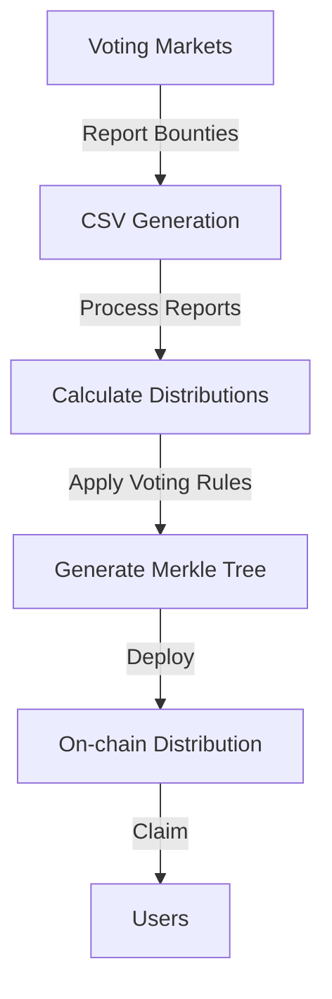

# sdToken Distribution System

The sdToken distribution system manages voting incentives for Stake DAO's liquid locker tokens. It processes rewards from various voting markets and distributes them to voters based on their participation in Snapshot governance.

## 📋 Table of Contents

- [Overview](#overview)
- [Supported Protocols](#supported-protocols)
- [Distribution Flow](#distribution-flow)
- [Key Components](#key-components)
- [Usage](#usage)
- [Raw Token Distributions](#raw-token-distributions)

## Overview

The system processes weekly voting incentives and creates merkle trees for efficient on-chain distribution. It supports:
- Multiple voting markets (Votemarket, Hidden Hand, Warden)
- Delegation with automatic reward sharing
- Multi-protocol support
- Raw token distributions alongside sdTokens

## Supported Protocols

| Protocol | Token | Space | Network |
|----------|-------|-------|---------|
| Curve | sdCRV | sdcrv.eth | Ethereum |
| Balancer | sdBAL | sdbal.eth | Ethereum |
| Frax | sdFXS | sdfxs.eth | Ethereum |
| FXN | sdFXN | sdfxn.eth | Ethereum |
| Pendle | sdPENDLE | sdpendle.eth | Ethereum |
| Cake | sdCAKE | sdcake.eth | BSC |

## Distribution Flow



### 1. **Bounty Collection**
Platforms report voting incentives in CSV format:
```csv
gauge address;gauge name;reward token;reward amount;reward sd value
0x123...;ETH/USDC;0xabc...;1000;500
```

### 2. **Distribution Calculation**
The system:
- Fetches Snapshot proposal results
- Calculates voter shares based on voting power
- Handles delegation rewards
- Processes both direct voters and delegators

### 3. **Merkle Generation**
Creates merkle trees containing:
- User addresses
- Reward amounts
- Proof data for claiming

## Key Components

### generateMerkle.ts
Main entry point that:
- Processes all protocols
- Handles both sdToken and raw token distributions
- Generates merkle trees
- Prepares contract update transactions

### Key Functions

```typescript
// Process weekly distributions
const main = async () => {
  // Fetch proposals and delegations
  const proposalIdPerSpace = await fetchLastProposalsIds(SPACES, now, filter);
  
  // Process each space
  for (const space of Object.keys(proposalIdPerSpace)) {
    // Extract CSV data
    const csvResult = await extractCSV(currentPeriodTimestamp, space);
    
    // Create merkle tree
    const merkleStat = await createMerkle(...);
    
    // Prepare contract updates
    toFreeze[network].push(tokenAddress);
    toSet[network].push(merkle.root);
  }
  
  // Process raw token distributions
  const rawTokenDistributions = await extractAllRawTokenCSVs(currentPeriodTimestamp);
  // ... process raw tokens
}
```

## Usage

### Generate Weekly Distribution

```bash
# Generate merkle trees for current week
npm run generate-merkle

# With logging enabled
npm run generate-merkle -- --log
```

### Output Files

Generated files are saved to `bounties-reports/{timestamp}/`:
- `merkle.json` - Complete merkle tree data
- `delegationsAPRs.json` - Delegation APR calculations
- Individual protocol CSVs

## Raw Token Distributions

The system supports distributing raw tokens (like CRV, BAL) instead of sdTokens:

### Setup
Place CSV files in `bounties-reports/{timestamp}/raw/{protocol}/`:
```csv
gauge address;reward token;reward amount;space
0x123...;0xD533a949740bb3306d119CC777fa900bA034cd52;1000;sdcrv.eth
```

### Processing
- Uses the same voting rules as the specified space
- Creates separate merkle trees for each unique token
- Distributes raw tokens instead of wrapped versions

See [Raw Token Distribution Guide](../../README-raw-tokens.md) for details.

## Delegation System

The system supports automatic delegation reward distribution:

1. **Delegation Detection**: Identifies delegated voting power
2. **Reward Calculation**: Splits rewards based on delegation percentages
3. **APR Tracking**: Calculates and stores delegation APRs

### Special Addresses
- `0x52ea58f4FC3CEd48fa18E909226c1f8A0EF887DC` - Main delegation address
- `0x0657C6bEe67Bb96fae96733D083DAADE0cb5a179` - Auto-voter delegation

## Error Handling

The system includes verification steps:
- Validates CSV data completeness
- Checks proposal existence
- Verifies token balances
- Ensures distribution accuracy

## Configuration

Key constants in `utils/constants.ts`:
```typescript
export const SPACES = [SDCRV_SPACE, SDBAL_SPACE, ...];
export const SPACES_TOKENS = {
  [SDCRV_SPACE]: SD_CRV,
  [SDBAL_SPACE]: SD_BAL,
  ...
};
```